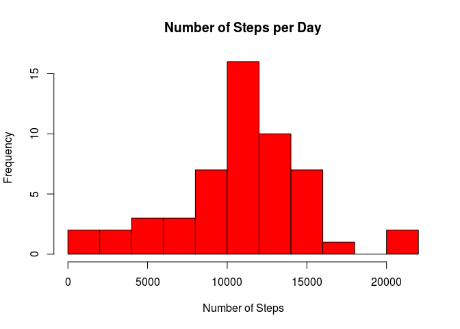
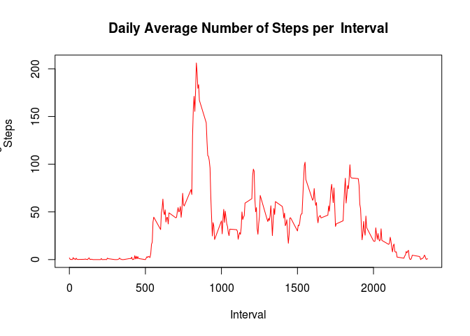
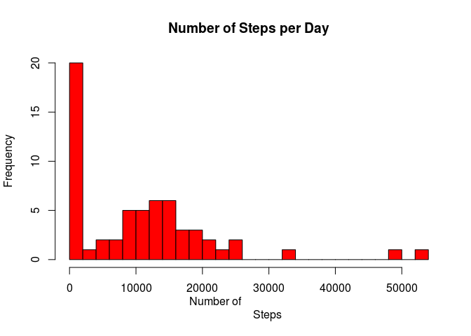
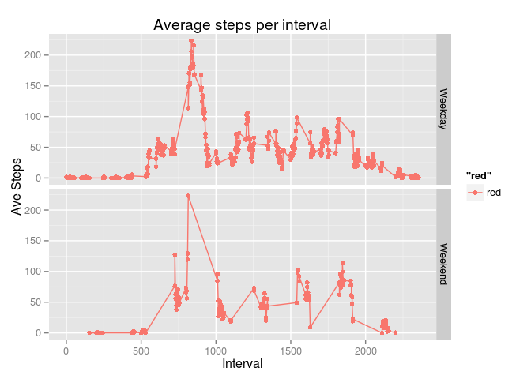

# Reproducible Research: Peer Assessment 1


## Loading and preprocessing the data
Load activity.csv and format the Date correctly using as.Date

```r
library(plyr)
data<-read.csv("activity.csv")
data$date<-as.Date(data$date,"%Y-%m-%d")                
```

## What is mean total number of steps taken per day?
Here is a histogram on the number of steps taken per pay

```r
        datasum<-ddply(data,.(date),summarize, steps= sum(steps))
        hist(datasum$steps, main="Number of Steps per Day",xlab="Numer of Steps",breaks=15,col="red")
```

 

Turn data into Steps per day and then calculate the mean and median


```r
        ##prints mean steps per day
        mean(datasum$steps,na.rm=TRUE)
```

```
## [1] 10766.19
```

```r
        ##prints median steps per day
        median(datasum$steps,na.rm=TRUE)
```

```
## [1] 10765
```


## What is the average daily activity pattern?
This histogram shows the anverage number of steps per the 5-minute interval times

```r
        dataave<-ddply(data,.(interval),summarize, steps=mean(steps,na.rm=TRUE))
        plot1<-plot(x=dataave$interval, y=dataave$steps,type="l",xlab="Interval",ylab="Average
                    Steps",main="Daily Average Number of Steps per  Interval",col="red")
```

 

So which interval has the most steps of average?

        

```r
        #highest value for averagesteps per day
        print(max(dataave$steps,na.rm=TRUE))
```

```
## [1] 206.1698
```

```r
        #the interval
        dataave$interval[dataave$steps==max(dataave$steps,na.rm=TRUE)]
```

```
## [1] 835
```

## Imputing missing values
Lets take a look at the missing data in the dataset:

```r
        NAs <-sapply(data, function(data) sum(length(which(is.na(data)))))
        
        print(NAs)## prints Number of NAs in each column (finding our NAs)
```

```
##    steps     date interval 
##     2304        0        0
```
I used the mean of steps over each interval and day of the week to create the imputed NA values from the data set.

```r
         ##add col to show it is imputed or not
        dataref<-mutate(data,isImputed = is.na(data$steps))
        
        ##make a key of average steps per interval and day of the week to use to impute NA values
        dataref<-ddply(dataref[dataref$isImputed==FALSE,],.(interval,date),summarize, steps=mean(steps,na.omit=TRUE),date=weekdays(date))
        dataref<-aggregate(dataref$steps,list(dataref$interval, dataref$date),mean)
        dataref<-setNames(dataref,c("interval","date","steps"))
        
        ##create data with NAs imputed using dataref
        dataimp<-data
        dataimp$date<-weekdays(dataimp$date)
        dataimp<-mutate(dataimp,isImputed = is.na(data$steps))
        library(data.table)
        setDT(dataimp)
        setDT(dataref)
        ##Use int for steps (rounds the average to int)
        dataref$steps<-as.integer(dataref$steps)
        
        setkey(dataimp,interval,date); setkey(dataref,interval,date)
        dataimp<-
                dataimp[dataref, steps := ifelse(is.na(steps), i.steps, steps) ]
        
        dataimp<-data.frame(dataimp)
```
The NAs are now filled in.  Lets take a look

```r
        #find NAs in imputed data
        NAis <-sapply(dataimp, function(dataimp) sum(length(which(is.na(dataimp)))))
        print(NAis )## prints Number of NAs in dataframe (should have none)
```

```
##     steps      date  interval isImputed 
##         0         0         0         0
```
Lets check out the Number of steps per day with the imputed data

```r
 #turn date back to normal date
        dataimp$date<-data$date
        datasumi<-ddply(dataimp,.(date),summarize, steps= sum(steps))
        hist(datasumi$steps, main="Number of Steps per Day",xlab="Numer of                        
             Steps",breaks=30,col="red")
```

 

You can see there is much higher amount of days with 0 steps in the imputed data. The data of course now with added step values have increased toward a greater number of steps, but other than that the data maintains a similar pattern as does the not imputed data.  
Calculate the mean and median


```r
        ##prints mean steps per day
        mean(datasumi$steps,na.rm=TRUE)
```

```
## [1] 10809.79
```

```r
        ##prints median steps per day
        median(datasumi$steps,na.rm=TRUE)
```

```
## [1] 10316
```

The two affects mentioned previously explain the shifting of the median (all the added zero values) and the average to the right (adding all the extra steps.)


## Are there differences in activity patterns between weekdays and weekends?
The weekend and weekday groups follow similar patterns when looking at the average steps per interval.  This graph also shows the imputed values are fit in nicely with the patterns seen in the actual data.

```r
        ##seperate weekends from weekdays
        library(chron)
        library(ggplot2)
        dataimp$date<-is.weekend(dataimp$date)
        datawk<-ddply(dataimp, .(interval, date, isImputed),summarize, steps=mean(steps))
        datawk<-ddply(datawk,.(interval,date,isImputed),summarize,steps=sum(steps),
                        date=if(date==TRUE){date<-"Weekend"}else{date<-"Weekday"})
        plot.final<-qplot(x=interval,y=steps,data=datawk,geom=c("point","line"),
                        facets = date~.,xlab="Interval",ylab="Ave Steps",type="l", col=isImputed,                           main="Average steps per interval")
        print(plot.final)
```

 


